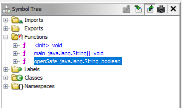
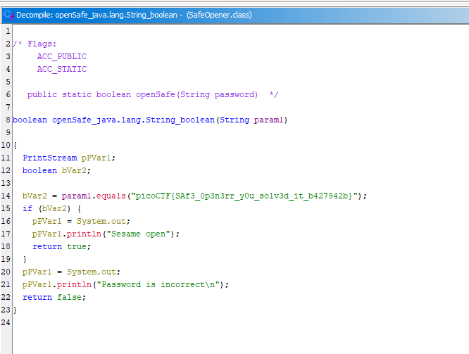

## Summary
This challenge provides us with a compiled Java file `SafeOpener.class` with the following description:
```
What can you do with this file?

I forgot the key to my safe but this file is supposed to help me with retrieving the lost key. Can you help me unlock my safe?
```

Artifacts:
- [SafeOpener.class](https://github.com/ssung099/CTF-Writeups/blob/main/picoCTF/rev/Safe%20Opener%202/chall/SafeOpener.class): the chall file

## Solve explanation
Given that we are given a compiled file, let's use Ghidra to inspect the code.


Taking a look at the defined functions in the symbol tree, we can see that there are two functions, `main` and `openSafe`, in the compiled binary.

Let's take a look at the `openSafe` function.



We can find the flag directly in the function and we have solved the challenge.

## Alternate solve
Given that the flag string was embedded directly into the file, we could have actually used the `strings` command to solve this challenge without the use of any decompiler.

```
$ strings SafeOpener.class 
...
java/io/BufferedReader
java/io/InputStreamReader
Enter password for the safe: 
java/lang/StringBuilder
You have  
 attempt(s) left
,picoCTF{SAf3_0p3n3rr_y0u_solv3d_it_b427942b}
Sesame open
Password is incorrect
SafeOpener
java/lang/Object
java/util/Base64$Encoder
...
```

This is a good reminder to check for embedded strings before reaching for a decompiler, since a quick `strings` pass can sometimes reveal the flag directly.