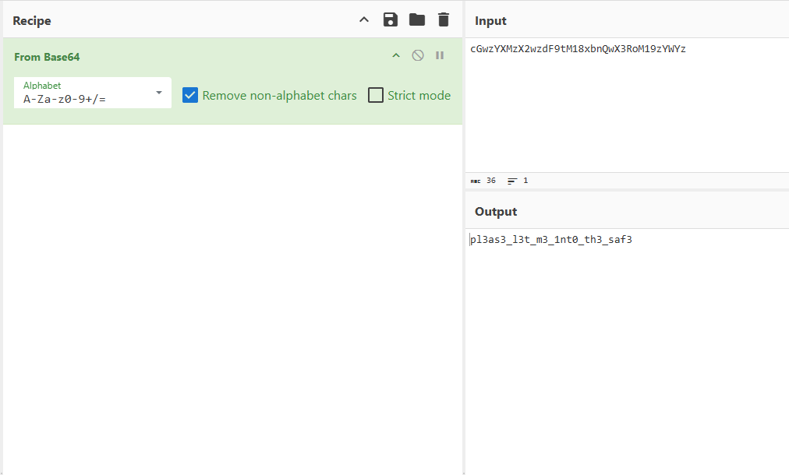

## Summary
This challenge provides a java source file `SafeOpener.java` with the following description:
```
Can you open this safe?

I forgot the key to my safe but this program
 is supposed to help me with retrieving the lost key. Can you help me unlock my safe?

Put the password you recover into the picoCTF flag format like:

picoCTF{password}
```

Artifacts:
- [SafeOpener.java](https://github.com/ssung099/CTF-Writeups/blob/main/picoCTF/rev/Safe%20Opener/chall/SafeOpener.java): the chall file

## Solve Explanation
Inspecting the source file, we see the function `openSafe`:
```
public static boolean openSafe(String password) {
    String encodedkey = "cGwzYXMzX2wzdF9tM18xbnQwX3RoM19zYWYz";
    
    if (password.equals(encodedkey)) {
        System.out.println("Sesame open");
        return true;
    }
    else {
        System.out.println("Password is incorrect\n");
        return false;
    }
}
```

Immediately, I saw that the "password" to open the safe was the value `cGwzYXMzX2wzdF9tM18xbnQwX3RoM19zYWYz`. 
Trying the flag `picoCTF{cGwzYXMzX2wzdF9tM18xbnQwX3RoM19zYWYz}`, however, did not work.

Looking at other parts of the file, I notice that the input is read in by an object of type `Base64.Encoder`.
```
BufferedReader keyboard = new BufferedReader(new InputStreamReader(System.in));
Base64.Encoder encoder = Base64.getEncoder();
...
    System.out.print("Enter password for the safe: ");
    key = keyboard.readLine();

    encodedkey = encoder.encodeToString(key.getBytes());
```

We can decode the value from Base64 using CyberChef.


Using the decoded value, we can submit the flag `picoCTF{pl3as3_l3t_m3_1nt0_th3_saf3}` and solve the challenge.