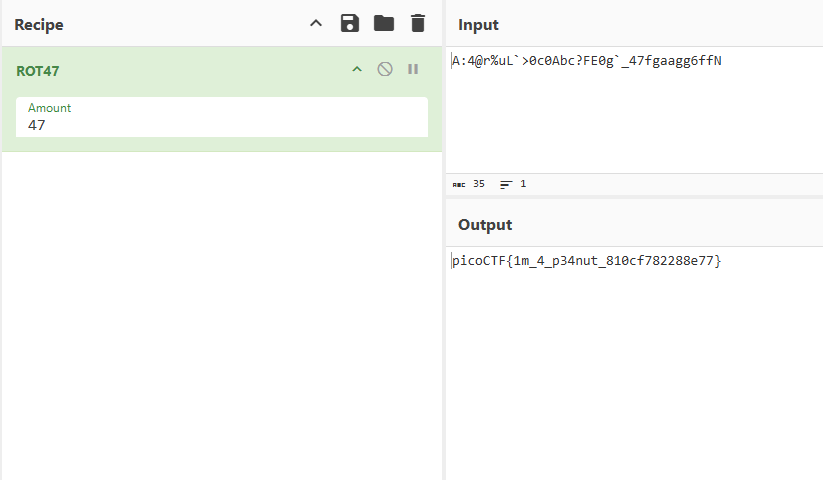

## Summary
This challenge provides a Python source file `crackme_gen.py` with no description.

Artifacts:
- [crackme_gen.py](https://github.com/ssung099/CTF-Writeups/blob/main/picoCTF/rev/crackme-py/chall/crackme_gen.py): the chall file

## Solve explanation
Inspecting the challenge file with `cat crackme_gen.py`, we can see two functions in the file: `decode_secret` and `choose_greatest`.

```python
def decode_secret(secret):
    """ROT47 decode

    NOTE: encode and decode are the same operation in the ROT cipher family.
    """

    # Encryption key
    rotate_const = 47

    # Storage for decoded secret
    decoded = ""

    # decode loop
    for c in secret:
        index = alphabet.find(c)
        original_index = (index + rotate_const) % len(alphabet)
        decoded = decoded + alphabet[original_index]

    print(decoded)

def choose_greatest():
    """Echo the largest of the two numbers given by the user to the program

    Warning: this function was written quickly and needs proper error handling
    """

    user_value_1 = input("What's your first number? ")
    user_value_2 = input("What's your second number? ")
    greatest_value = user_value_1 # need a value to return if 1 & 2 are equal

    if user_value_1 > user_value_2:
        greatest_value = user_value_1
    elif user_value_1 < user_value_2:
        greatest_value = user_value_2

    print( "The number with largest positive magnitude is "
        + str(greatest_value) )
```

`choose_greatest` doesn't seem to do anything important; it compares two user input numbers and returns the larger one.

`decode_secret` uses ROT47 to decode a value, but it's never called by the script itself. 

Using CyberChef, we can run ROT47 on the `bezos_cc_secret` value defined in the file.



The secret value does in fact decode to a flag and we have solved the challenge.