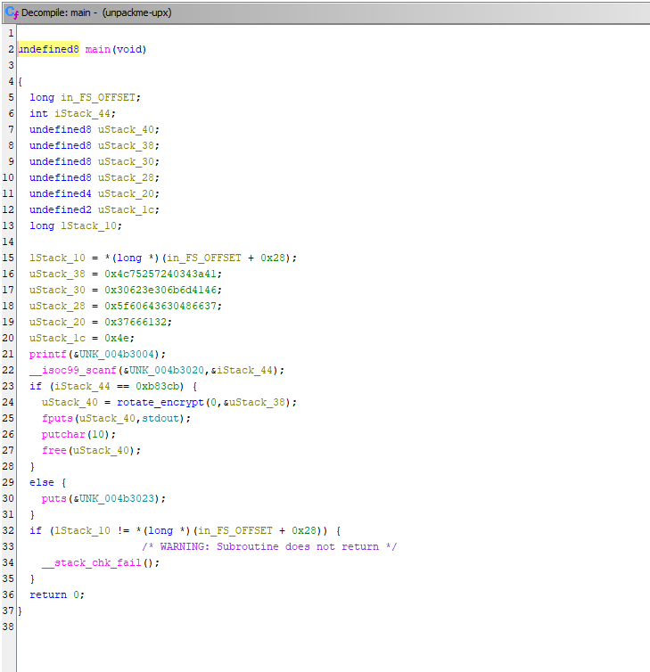

## Summary
This challenge provides a file `unpackme-upx` with the following description:
```
Can you get the flag?
Reverse engineer this binary.
```

Artifacts:
- [unpackme-upx](https://github.com/ssung099/CTF-Writeups/blob/main/picoCTF/rev/unpackme/chall/unpackme-upx): the chall file

## Solve explanation
Given that the challenge file is named `unpackme-upx`, the first thing I did was unpack the file with upx.

```
$ upx -d unpackme-upx
...
Unpacked 1 file.
```

Running the executable gives us the following prompt:
```
$ chmod +x ./unpackme-upx 
$ ./unpackme-upx 
What's my favorite number? 
```

To find the "favorite number", I tried decompiling it in Ghidra to get a better sense of what the program does.

Let's take a look at the main function.


We can see that the program compares the user input with the hex value `0xb83cb`. Converting this value into decimal gets us the value `754635`.

Running the program again and inputting this value gets us the flag and solves the challenge.
```
$ ./unpackme-upx 
What's my favorite number? 754635
picoCTF{up><_m3_f7w_e510a27f}
```