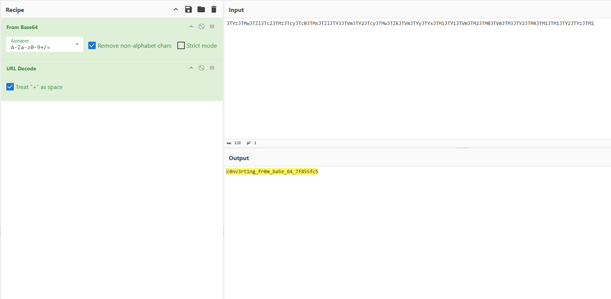

## Challenge Description
This challenge provides us with a Java source file with the following description:
```
In the last challenge, you mastered octal (base 8), decimal (base 10), and hexadecimal (base 16) numbers, but this vault door uses a different change of base as well as URL encoding!
```

Artifacts:
- [VaultDoor5.java](https://github.com/ssung099/CTF-Writeups/blob/main/picoCTF/rev/vault-door-5/chall/VaultDoor5.java): the chall file
- [solve.py](https://github.com/ssung099/CTF-Writeups/blob/main/picoCTF/rev/vault-door-5/chall/solve.py): the solve script

## Solve Explanation
Similar to the previous `Vault Door` challenges, the challenge file has a `checkPassword` function that verifies our input.

```java
public boolean checkPassword(String password) {
    String urlEncoded = urlEncode(password.getBytes());
    String base64Encoded = base64Encode(urlEncoded.getBytes());
    String expected = "JTYzJTMwJTZlJTc2JTMzJTcyJTc0JTMxJTZlJTY3JTVm"
                    + "JTY2JTcyJTMwJTZkJTVmJTYyJTYxJTM1JTY1JTVmJTM2"
                    + "JTM0JTVmJTM3JTY2JTM4JTM1JTM1JTY2JTYzJTM1";
    return base64Encoded.equals(expected);
}
```

The function takes our password input, URL-encodes it, and then Base64-encodes the result before cross-checking it with a fixed value. This means that we can use this fixed value to reverse engineer the correct password.

Taking the expected value, we can decode it from Base64 and URL-decode it to get the initial value. I used CyberChef to retrieve the initial value, but you can also write a simple python script that would do the same.



After decoding the value, we get a readable string value, `c0nv3rt1ng_fr0m_ba5e_64_7f855fc5`. Wrapping this value with the flag header `picoCTF{}`, we are able to get the flag and solve the challenge.
```
picoCTF{c0nv3rt1ng_fr0m_ba5e_64_7f855fc5}
```